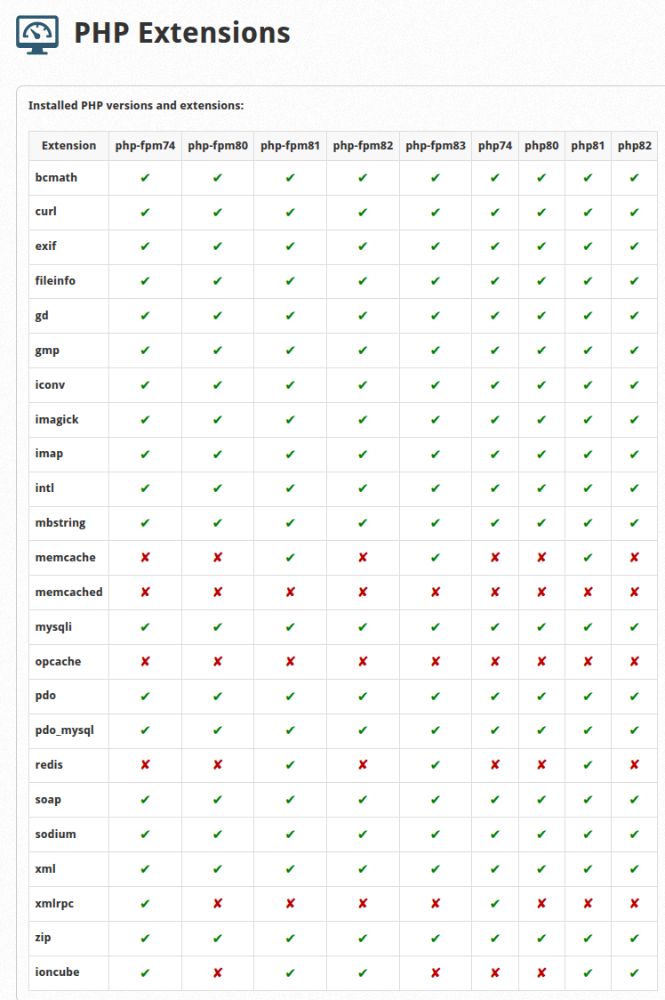

# imh-php-extension, v0.0.1

PHP versions and extension table

- cPanel/WHM path: `/usr/local/cpanel/whostmgr/docroot/cgi/imh-php-extension/index.php`
- CWP path: `/usr/local/cwpsrv/htdocs/resources/admin/modules/imh-php-extension.php`

## Screenshot

# Installation

- Run as the Root user: `curl -fsSL https://raw.githubusercontent.com/gemini2463/imh-php-extension/master/install.sh | sh`

# Files

## Shell installer

- install.sh

## Main script

- index.php - Identical to `imh-php-extension.php`.
- index.php.sha256 - `sha256sum index.php > index.php.sha256`
- imh-php-extension.php - Identical to `index.php`.
- imh-php-extension.php.sha256 - `sha256sum imh-php-extension.php > imh-php-extension.php.sha256`

## Javascript

- imh-php-extension.js - Bundle React or any other javascript in this file.
- imh-php-extension.js.sha256 - `sha256sum imh-php-extension.js > imh-php-extension.js.sha256`

## Icon

- imh-php-extension.png - [48x48 png image](https://api.docs.cpanel.net/guides/guide-to-whm-plugins/guide-to-whm-plugins-plugin-files/#icons)
- imh-php-extension.png.sha256 - `sha256sum imh-php-extension.png > imh-php-extension.png.sha256`

## cPanel conf
- imh-php-extension.conf - [AppConfig Configuration File](https://api.docs.cpanel.net/guides/guide-to-whm-plugins/guide-to-whm-plugins-appconfig-configuration-file)
- imh-php-extension.conf.sha256 - `sha256sum imh-php-extension.conf > imh-php-extension.conf.sha256`

## CWP include

- cwp-include.php - [CWP include](https://wiki.centos-webpanel.com/how-to-build-a-cwp-module)
- cwp-include.php.sha256 - `sha256sum cwp-include.php > cwp-include.php.sha256`

